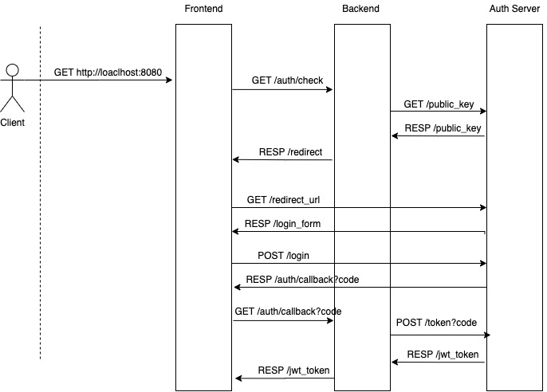

# Настройка внешнего сервера авторизации 
Перед вами заготовка проекта, реализующего авторизацию при помощи 
сервера KeyCloak. Проект состоит из следующийх компонентов:
1. Фронтенд - статика, которую сервит [Nginx](https://www.nginx.com)
2. Бэкенд - Python-сервер на [Fast-API](https://fastapi.tiangolo.com)
3. Сервер авторизации - [KeyCloak](https://www.keycloak.org)

## Запуск проекта
Для запуска работы необходимо установить docker, после чего выполнить команды
```bash
docker compose up
```

Clean up:
```bash
docker compose down
docker compose down -v
```

## Что необходимо делать
Необходимо выполнить следующие шаги
1. Запустить все компоненты и сконфигурировать KeyCloak
2. Поставить коррекртные переменные оккружения в docker-compose.yaml
3. Добавить политики разграничения доступа в хэндлеры в файле backend/server.py

## Чего делать не нужно
1. Дописывать что-то во фронте, так как там уже реализована логика, вам лишь необходимо понять общую схему работы
2. Модифицировать хэндлеры: /auth/check /auth/logout /auth/callback

## Требования к выполнению работы
1. Необходимо настроить KK и бэк так, чтобы у вас было как минимум 6 пользователей и 3 групы
* Группа 1 - доступ только /api/group_1
* Группа 2 - доступ только /api/group_2
* Группа 3 - доступ только /api/group_3
* Группа 4 - доступ ок всем группам

## Схема происходящего
